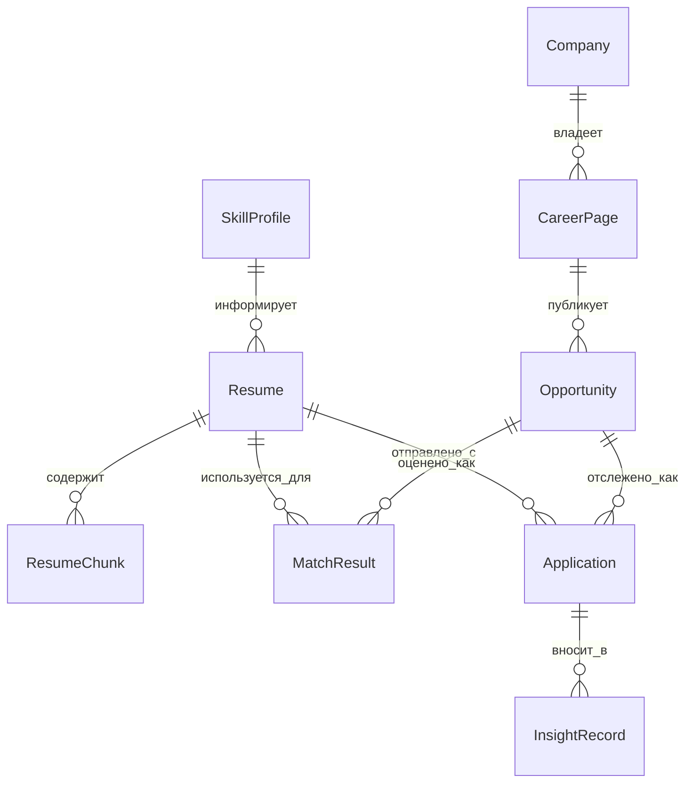

# Модель данных

См. также: [index.md](./index.md)

## Назначение

Этот документ определяет архитектурную модель данных для CeeVee.

## Хранилища данных

Утвержденная модель хранения:

- Supabase Postgres для первичных реляционных данных
- `pgvector` в той же базе данных для embeddings
- object storage для загруженных файлов резюме

## Основные сущности

- `Resume`
  Представляет управляемую пользователем версию резюме и метаданные исходного файла.

- `ResumeChunk`
  Представляет семантически значимый chunk, извлеченный из резюме для вариантов использования retrieval.

- `SkillProfile`
  Представляет явно перечисленные пользователем skills и выведенные skill-доказательства из контента резюме.

- `Company`
  Представляет обнаруженную компанию-кандидата с метаданными источника.

- `CareerPage`
  Представляет известный URL страницы карьеры и метаданные обнаружения ATS.

- `Opportunity`
  Представляет нормализованный job-листинг.

- `MatchResult`
  Представляет score, объяснение и рекомендацию резюме для пары opportunity-резюме.

- `Application`
  Представляет событие application со статусом как applied, interview, rejection или no response.

- `InsightRecord`
  Представляет сгенерированные паттерны, рекомендации или learning-сигналы, выведенные из предыдущих applications.

## Диаграмма взаимосвязей сущностей

Назначение:
Эта диаграмма показывает основные персистентные сущности и их взаимосвязи.

Что должен понять читатель:
Архитектура центрирована вокруг резюме, opportunities и истории applications, с retrieval-связанными сущностями, поддерживающими эти основные потоки.

Почему диаграмма принадлежит здесь:
Структура сущностей и взаимосвязи являются аспектами модели данных.

## Заметки жизненного цикла данных

### Resume

- загружается однажды
- версионируется со временем
- chunked для retrieval
- ссылается через матчинг и cover-letter-фичи

### Opportunity

- обнаружено через скрапинг
- нормализовано в стабильную внутреннюю форму
- пересчитано когда релевантный контекст резюме или retrieval изменяется

### Application

- создается когда пользователь отмечает opportunity как applied
- обновляется когда результаты изменяются
- вносит в будущие insights и similarity retrieval

## Обязанности векторного поиска

Векторный retrieval используется для:

- similarity истории applications
- retrieval chunks резюме

Векторный слой не должен заменять реляционный источник истины. Он только дополняет ранжированный retrieval.

## Риски данных

- дублированные opportunities через повторный скрапинг
- устаревшие snapshots страниц карьеры
- слабое качество chunking уменьшает качество retrieval
- неконтролируемый рост сгенерированных записей insights

Имплементация поэтому должна включать правила identity, freshness и retention даже если первый MVP держит их простыми.
