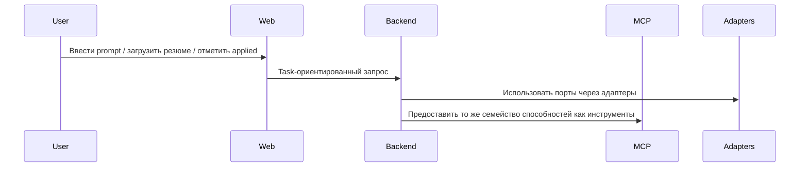

# Интерфейсы

См. также: [index.md](./index.md)

## Назначение

Этот документ определяет основные архитектурные интерфейсы CeeVee.

## Категории интерфейсов

- Web-к-backend интерфейс приложения
- Интерфейс MCP-инструментов
- Интерфейсы портов внутри domain
- Интерфейсы внешних провайдеров

## Web-к-backend интерфейс

Web app общается только с backend-сервисом. Backend является авторитетным владельцем:

- ingestion резюме
- обнаружение компаний
- оркестрация скрапинга
- ranking opportunities
- отслеживание applications
- retrieval insights
- генерация scaffolding для cover letter

Контракт frontend должен предпочитать task-ориентированные endpoints над low-level провайдер-специфичными API.

## Интерфейс MCP-инструментов

Backend предоставляет стабильную MCP-инструмент поверхность для agent-driven использования.

Начальные инструменты:

- `discover_companies(prompt)`
  Возвращает список компаний-кандидатов для поискового prompt на естественном языке.

- `scrape_career_page(url)`
  Возвращает нормализованные job-листинги для одиночной страницы карьеры.

- `match_resume(job_id, resume_id)`
  Возвращает score, объяснение и рекомендацию для пары job-резюме.

- `log_application(job_id, resume_id)`
  Сохраняет событие application и его текущее состояние.

- `get_application_insights()`
  Возвращает retrieval-поддерживаемые паттерны из предыдущих applications.

## Поток интерфейса

Назначение:
Эта диаграмма показывает как один и тот же backend-слой способностей обслуживает как web app так и MCP-потребителей.

Что должен понять читатель:
MCP-поверхность не является отдельным стеком бизнес-логики. Это другой интерфейс к тому же набору backend-способностей.

Почему диаграмма принадлежит здесь:
Этот файл владеет архитектурными границами интерфейсов и потребителями интерфейсов.

## Ожидания контрактов портов

Каждый domain-порт должен специфицировать:

- назначение
- форму запроса и ответа
- ожидания валидации
- режимы сбоев
- ownership
- ожидания совместимости

## Поведение при сбоях

Архитектурное поведение интерфейса должно различать между:

- пользователь-видимыми ошибками валидации
- временными сбоями провайдера
- сбоями экстракции скрапинга
- деградацией retrieval
- отсутствующими ссылками на резюме или opportunities

Backend должен возвращать стабильные, категоризированные сбои вместо прямого протекания провайдер-специфичных ошибок.

## Ожидания эволюции

- MCP-имена инструментов должны оставаться стабильными однажды опубликованные
- web endpoints могут эволюционировать быстрее, но должны оставаться task-ориентированными
- интерфейсы портов могут изменяться только с явной координацией через затронутые модули
