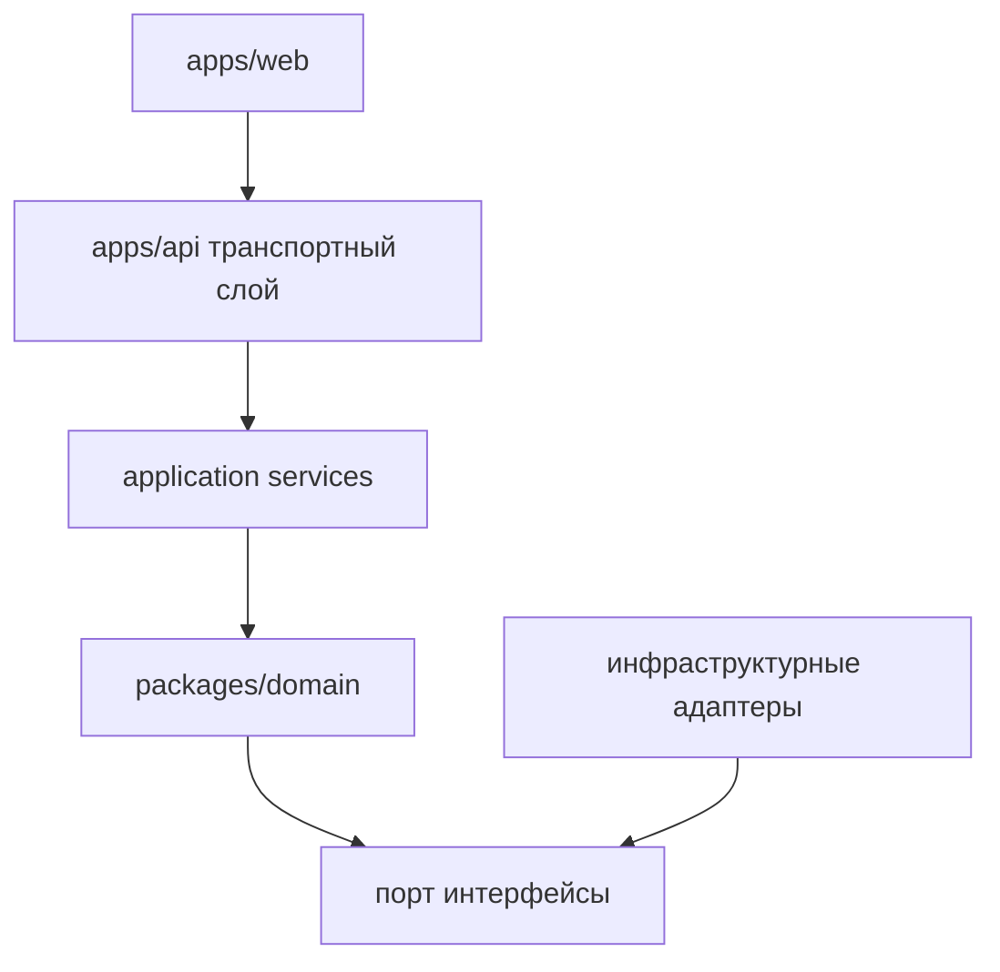

# Дизайн модулей

См. также: [index.md](./index.md)

## Назначение

Этот документ определяет внутреннюю структуру модулей и границы ownership архитектуры CeeVee.

## Форма монорепозитория

Утвержденная форма репозитория:

- `apps/web`
  Frontend на Next.js App Router

- `apps/api`
  Node.js backend-сервис, предоставляющий HTTP- и MCP-ориентированные возможности

- `packages/domain`
  Чистые бизнес-сущности, варианты использования и определения портов

- `packages/shared`
  Общие DTO, схемы и стабильные кросс-runtime типы

## Внутренние архитектурные слои

Назначение:
Эта диаграмма показывает внутреннее наслоение от web-интерфейса к domain-ядру и инфраструктурным адаптерам.

Что должен понять читатель:
Domain определяет требуемые способности через порты, и адаптеры удовлетворяют эти порты без протекания инфраструктурных аспектов в ядро.

Почему диаграмма принадлежит здесь:
Наслоение и ownership модулей являются аспектами дизайна модулей.

## Основные доменные области

Backend-домен разделен на эти основные области:

- `resume`
  Метаданные загрузки резюме, жизненный цикл версий, chunks резюме и ссылки на инвентарь skills

- `company-discovery`
  Интерпретация поиска на естественном языке и генерация компаний-кандидатов

- `scraping`
  Получение страниц карьеры, обнаружение ATS, экстракция и нормализация jobs

- `opportunities`
  Нормализованные job opportunities и состояние ranking

- `matching`
  Scoring резюме-к-job, reasoning и генерация рекомендаций

- `applications`
  Applied состояние, результаты и вводы истории retrieval

- `insights`
  Learning-система, обнаружение паттернов и генерация skill-gap backlog

- `cover-letter`
  Генерация scaffolding на основе контекста компании и job плюс релевантных chunks резюме

## Определения портов

Domain владеет портами как:

- `CompanyDiscoveryPort`
- `CareerPageScraperPort`
- `AtsDetectorPort`
- `JobNormalizationPort`
- `MatchEnginePort`
- `ResumeRepositoryPort`
- `OpportunityRepositoryPort`
- `ApplicationRepositoryPort`
- `EmbeddingPort`
- `RetrievalPort`
- `CoverLetterPort`

Каждый порт должен определять назначение, форму ввода, форму вывода и поведение при сбоях.

## Категории адаптеров

Backend владеет этими категориями адаптеров:

- `llm`
  Для обнаружения, поддержки reasoning и scaffolding контента

- `supabase`
  Для реляционной персистентности и векторного поиска

- `ats`
  Провайдер-специфичные адаптеры скрапинга для Greenhouse, Lever, Workday и Ashby

- `mcp`
  Для предоставления backend-возможностей как MCP-инструментов

- `storage`
  Для обработки файлов резюме и доступа к документам

- `jobs`
  Для асинхронных потоков скрапинга, обогащения и повторной обработки

## Backend application services

Application services оркестрируют доменные варианты использования и порты. Они ответственны за:

- границы транзакций где необходимо
- последовательность обнаружения, скрапинга, scoring и персистентности
- выбор синхронного versus асинхронного выполнения
- подготовку MCP-ориентированных результатов

Они не ответственны за:

- UI-рендеринг
- прямой SQL внутри основных вариантов использования
- провайдер-специфичные детали prompts или скрапинга

## Граница frontend

Frontend может:

- рендерить пользовательские потоки
- отправлять команды в backend
- представлять ранжированные результаты и объяснения
- собирать пользовательскую обратную связь и результаты applications

Frontend не должен:

- реализовывать бизнес-логику матчинга
- scrapить внешние сайты напрямую
- владеть логикой retrieval
- конструировать провайдер-специфичное интеграционное поведение

## Готовность к будущему разделению

Архитектура намеренно держит следующие будущие точки разделения чистыми:

- async worker runtime для больших скрапинг jobs
- выделенный retrieval worker или evaluational pipeline
- отдельный MCP transport process если внешние клиенты растут

Это не отдельные сервисы в MVP, но границы документированы рано чтобы уменьшить будущую стоимость миграции.
