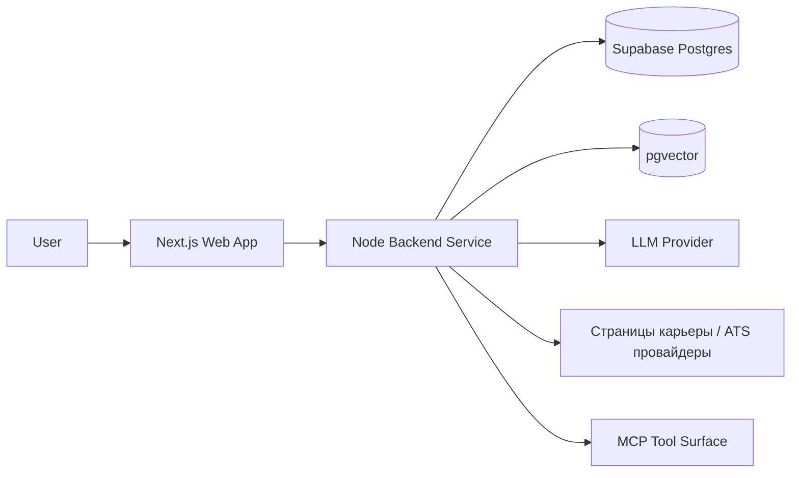

# Обзор архитектуры CeeVee

См. также: [index.md](./index.md)

## Назначение

Этот документ определяет утвержденное направление архитектуры для MVP CeeVee и его непосредственного пути масштабирования.

## Архитектурное резюме

CeeVee реализуется как TypeScript монорепозиторий с разделенными frontend и backend runtime:

- `apps/web` размещает frontend на Next.js App Router
- `apps/api` размещает отдельный Node.js backend-сервис
- `packages/shared` размещает общие типы и кросс-runtime контракты
- `packages/domain` размещает чистые доменные модели, варианты использования и определения портов

Архитектура следует гексагональному паттерну. Основная бизнес-логика зависит только от портов. Внешние системы, такие как Supabase, LLM-провайдеры, ATS-страницы карьеры и MCP-транспорт, изолированы за адаптерами.

## Выбранная форма runtime

### Утвержденное направление

Проект использует отдельный backend-сервис вместо API-маршрутов Next.js в качестве основного backend runtime.

### Почему это направление подходит этому проекту

Этот проект комбинирует:

- пользовательские потоки frontend
- предоставление MCP-инструментов
- внешний скрапинг
- AI-поддерживаемое матчинг
- retrieval и embeddings
- гибридную синхронную и асинхронную обработку

Эти аспекты операционно легче поддерживать в выделенном backend runtime, чем внутри coupled с frontend API-маршрутов.

### Базовая линия best-practice

Для систем, комбинирующих оркестрацию, ingestion, retrieval и внешние интеграции, четкое разделение между UI runtime и backend runtime является предпочтительной базовой линией.

### Адаптация для этого проекта

Проект остается MVP-сфокусированным, поэтому backend остается единственным сервисом, а не микросервисным флотом. Это сохраняет ясность без введения преждевременной сложности deployment.

## Архитектурные принципы

### 1. Гексагональные границы

Доменная логика не должна напрямую импортировать драйверы баз данных, HTTP-фреймворки, библиотеки скрапинга или LLM SDK.

### 2. Монорепозиторий с явным ownership

Frontend, backend и общие доменные контракты живут в одном репозитории, но каждая область имеет ясные границы ownership и runtime.

### 3. Adapter-first интеграции

Скрапинг страниц карьеры, обнаружение компаний, parsing резюме, матчинг и RAG retrieval смоделированы за явными портами, чтобы провайдеры могли быть изменены позже.

### 4. Гибридное выполнение

Короткие потоки обнаружения и матчинга могут выполняться синхронно. Большие рабочие процессы скрапинга и обогащения должны выполняться асинхронно через модель jobs.

### 5. Retrieval как продуктовая инфраструктура

Embeddings и семантический retrieval являются частью продуктовой архитектуры, а не опциональным дополнением позже.

## Объем MVP в архитектурных терминах

MVP-архитектура должна поддерживать:

- один аутентифицированный или локальный пользовательский контекст, текущий смоделирован как single-user система
- несколько версий резюме
- обнаружение компаний на естественном языке
- ATS-осознанный скрапинг страниц карьеры
- нормализованные записи opportunities
- scoring матчинга job-к-резюме
- отслеживание applications и результаты
- генерация skill backlog резюме
- поддержка scaffolding для cover letter
- обучение из предыдущих applications через retrieval

## Основная топология runtime

Назначение:
Эта диаграмма показывает разделение runtime на верхнем уровне и основные внешние зависимости.

Что должен понять читатель:
Frontend отделен от backend runtime, и backend владеет всеми интеграционно-емкими поведениями.

Почему диаграмма принадлежит здесь:
Этот файл определяет общее направление архитектуры и форму runtime.

## Основные компромиссы

### Выбрано

- Отдельный backend-сервис
- Один deployable backend runtime для MVP
- Явная async-способность без требования большой event-driven платформы

### Сознательно еще не выбрано

- Frontend-only API оркестрация
- Декомпозиция на микросервисы
- Multi-user tenant isolation
- Автоматизация auto-apply

## Путь масштабирования

Непосредственный путь масштабирования следующего этапа:

1.保持 структуру монорепозитория стабильной
2.保持 domain и ports повторно используемыми
3. Разделять long-running jobs на выделенные workers только когда runtime-давление оправдывает это
4. Сохранять MCP-совместимость на границе backend

Архитектура поэтому оптимизирована для MVP-доставки с низким трением пути к более сильному операционному разделению позже.
