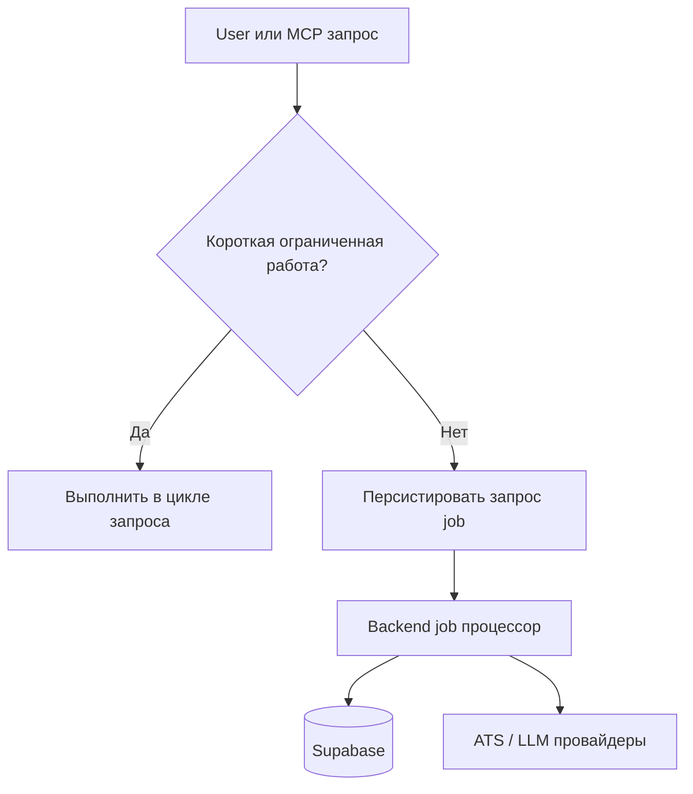

# Runtime и observability

См. также: [index.md](./index.md)

## Назначение

Этот документ определяет поведение runtime, подход к фоновой обработке и ожидания операционной видимости для CeeVee.

## Модель runtime

MVP использует:

- один frontend runtime
- один backend runtime
- одну платформу базы данных

Внутри backend работа разделена на синхронные потоки запросов и асинхронные потоки jobs.

## Sync versus async policy

### Синхронно по умолчанию для:

- отправка prompt
- запросы обнаружения компаний
- прямой просмотр opportunities
- retrieval match-результатов для уже известных данных
- логирование applications

### Асинхронно по умолчанию для:

- широкий скрапинг через многие компании
- повторный скрапинг устаревших страниц карьеры
- тяжелые проходы обогащения или переранжирования
- ретроспективное обновление insights

### Гибридное правило

Маленькие, ограниченные скрапинг tasks могут стартовать синхронно и продолжать асинхронно если runtime или провайдер лимиты превышены.

## Поток runtime

Назначение:
Эта диаграмма объясняет как архитектура разделяет немедленную обработку запросов от более длительных jobs.

Что должен понять читатель:
MVP не предполагает что все синхронно, даже если это все еще работает внутри одной границы backend-сервиса.

Почему диаграмма принадлежит здесь:
Этот файл владеет поведением runtime и операционным потоком.

## Ожидания надежности

Архитектура должна поддерживать:

- retryable вызовы внешних провайдеров где безопасно
- категоризированную запись сбоев
- resumable потоки скрапинга
- обнаружение устаревших данных для opportunities и страниц карьеры
- idempotent логирование applications где практично

## Ожидания observability

Backend должен эмитировать:

- структурированные логи для потоков обнаружения, скрапинга, матчинга и retrieval
- отслеживаемые job-идентификаторы
- контекст сбоев провайдера без протекания чувствительного контента документов
- метрики для成功率 скрапинга, match-латентности и использования retrieval

## Security- и privacy-релевантные ограничения runtime

- Файлы резюме и выведенные chunks чувствительны
- История applications чувствительна
- Логи должны избегать дампа сырого контента резюме или полных сгенерированных prompts по умолчанию
- Провайдер-ориентированные вызовы должны быть аудируемы на уровне событий

## Путь масштабирования

Первый шаг масштабирования должен быть:

1.保持 web app неизменным
2. Разделить выполнение jobs от request-serving если объем jobs растет
3. Сохранить те же domain и port интерфейсы

Это держит масштабирование-связанные изменения операционными вместо архитектурных где возможно.
