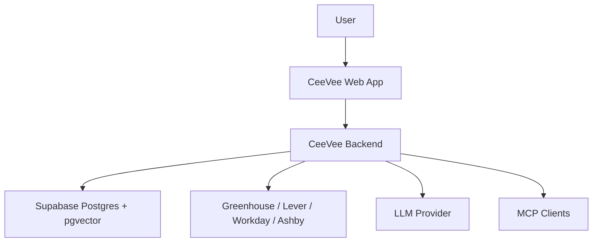

# Системный контекст

См. также: [index.md](./index.md)

## Назначение

Этот документ определяет акторов, границы системы и основные потоки взаимодействия вокруг CeeVee.

## Акторы

- User
  Загружает версии резюме, описывает намерение поиска, просматривает opportunities, отслеживает applications и просматривает insights.

- CeeVee Web App
  Пользовательская продуктовая поверхность для управления резюме, обнаружения, просмотра, отслеживания и презентации insights.

- CeeVee Backend
  Выполняет обнаружение, скрапинг, матчинг, retrieval, персистентность и предоставление MCP-инструментов.

- LLM Provider
  Поддерживает обнаружение компаний, поддержку reasoning, генерацию рекомендаций и scaffolding для cover letter.

- Страница карьеры / ATS провайдеры
  Источник job-листингов. Начальное семейство адаптеров нацелено на Greenhouse, Lever, Workday и Ashby.

- Supabase
  Предоставляет хранилище Postgres, векторное хранилище через pgvector и опциональную будущую границу auth.

## Граница системы

Назначение:
Эта диаграмма идентифицирует границу системы и основные внешние зависимости.

Что должен понять читатель:
Все нетривиальные интеграции принадлежат backend, в то время как web app остается пользовательским слоем.

Почему диаграмма принадлежит здесь:
Граница системы и отношения акторов являются контекстными аспектами.

## Основные пользовательские потоки

### Поток резюме и opportunities

1. User загружает одну или несколько версий резюме
2. User вводит поисковый prompt на естественном языке
3. Backend обнаруживает компании-кандидаты
4. Backend scraped страницы карьеры и нормализует job-листинги
5. Backend scored jobs против одной или нескольких версий резюме
6. Web app отображает ранжированные opportunities с объяснениями и рекомендациями

### Поток отслеживания applications

1. User отмечает job как applied
2. User записывает результаты со временем
3. Backend хранит историю applications
4. Retrieval использует эту историю для будущего scoring и генерации insights

### Поток поддержки skills и cover letter

1. User поддерживает секцию skills и версии резюме
2. Backend retrievet релевантные chunks резюме и контекст opportunities
3. Backend предлагает релевантные обновления резюме
4. Backend создает scaffolding для cover letter и предложения learning backlog

## Ключевые контекстные ограничения

- MVP преднамеренно single-user
- Система не auto-apply
- LinkedIn и Xing скрапинг преднамеренно вне объема
- Качество скрапинга зависит от структуры внешнего сайта и поведения ATS
- Качество retrieval зависит от подготовки данных и качества сохраненной истории

## Контекстные риски

- Внешняя ATS-структура может измениться без предупреждения
- Некоторые потоки скрапинга могут быть слишком медленными для полностью синхронного цикла запроса
- LLM-поддерживаемое обнаружение и reasoning может дрейфовать без отслеживаемых вводов
- Данные резюме и applications чувствительны и должны оставаться плотно ограниченными
