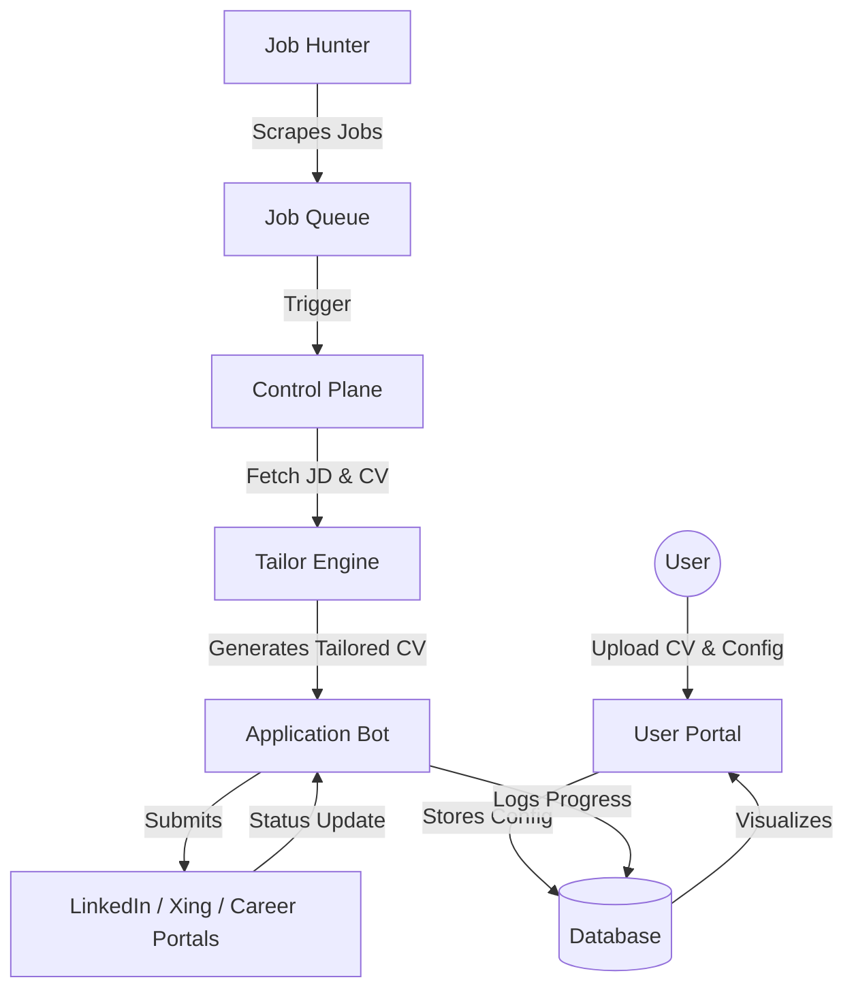

# System Design: JobApp Agent

## 1. Executive Summary
JobApp Agent is an autonomous, 24/7 service that manages the end-to-end job application lifecycle. It discovers opportunities, adapts resumes using generative AI, and submits applications on behalf of the user.

## 2. Core Components

### 2.1 User Portal (Frontend)
- **Purpose**: Configuration and monitoring.
- **Capabilities**:
    - Resume/CV upload (PDF/Docx).
    - Job preference configuration (Role, Location, Experience, Salary).
    - Real-time dashboard for application status.
    - Approval workflow for "high-stakes" applications.

### 2.2 Control Plane (Orchestrator)
- **Purpose**: Managing state and task distribution.
- **Capabilities**:
    - Job Queue management.
    - Scheduler for recurring scans.
    - Persistence of user data and application history.

### 2.3 Job Hunter (Discovery Engine)
- **Purpose**: Multi-source scraping and ingestion.
- **Sources**: LinkedIn, Xing, Company Career Pages (via RSS or direct scraping).
- **Capabilities**:
    - Browser-based scraping (handling dynamic content).
    - Proxy rotation to avoid rate limits.
    - Initial filtering against user preferences.

### 2.4 Tailor Engine (AI Service)
- **Purpose**: Semantic matching and content generation.
- **Capabilities**:
    - Job Description (JD) parsing.
    - Resume analysis vs. JD requirements.
    - LLM-powered CV/Cover Letter adaptation.
    - Keyword optimization for ATS (Applicant Tracking Systems).

### 2.5 Application Bot (Execution Engine)
- **Purpose**: Form filling and submission.
- **Capabilities**:
    - Playwright/Puppeteer-based browser automation.
    - Handling common application portals (Workday, Greenhouse, Lever).
    - Email integration for confirmation tracking.

## 3. Data Flow

## 4. Proposed Technology Stack

- **Backend**: Python (FastAPI) - Ideal for AI integration and scraping libraries.
- **Frontend**: React (Next.js) - Modern, SEO-friendly, and responsive.
- **Automation**: Playwright - Superior to Selenium for modern web apps.
- **AI**: OpenAI GPT-4o or Claude 3.5 Sonnet (via API).
- **Queue**: Redis + Celery (or Arq) for asynchronous task handling.
- **Database**: PostgreSQL (Relational data) + Supabase (Auth/Storage).

## 5. Safety & Compliance
- **Rate Limiting**: Intelligent delays to simulate human behavior.
- **Data Privacy**: Encrypted storage of resumes and personal data.
- **Transparency**: Every automated action is logged and auditable.
